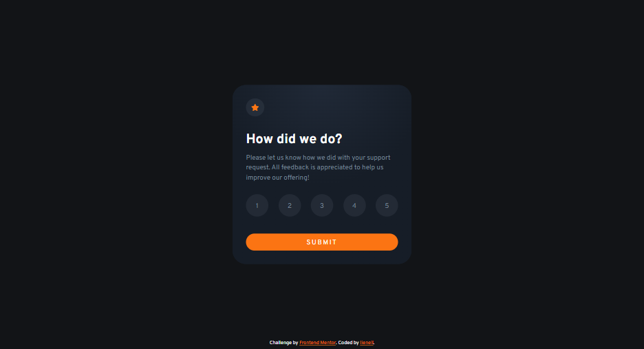
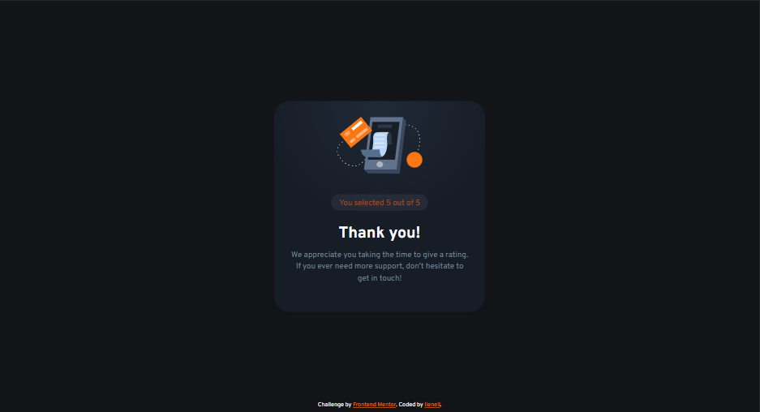
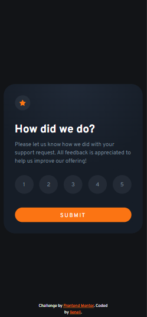

# Frontend Mentor - Interactive rating component solution

This is a solution to the [Interactive rating component challenge on Frontend Mentor](https://www.frontendmentor.io/challenges/interactive-rating-component-koxpeBUmI). Frontend Mentor challenges help you improve your coding skills by building realistic projects. 

## Table of contents

- [Overview](#overview)
  - [The challenge](#the-challenge)
  - [Screenshot](#screenshot)
  - [Links](#links)
- [My process](#my-process)
  - [Built with](#built-with)
  - [What I learned](#what-i-learned)
  - [Useful resources](#useful-resources)

## Overview

### The challenge

Users should be able to:

- View the optimal layout for the app depending on their device's screen size
- See hover states for all interactive elements on the page
- Select and submit a number rating
- See the "Thank you" card state after submitting a rating

### Screenshot

 
 

### Links

- [Live Demo]()

## My process

### Built with

- Semantic HTML5 markup
- CSS custom properties
- [SASS/SCSS](https://sass-lang.com) - CSS with superpower
- CSS Flexbox
- Vanilla Javascript

### What I learned

I learned using `<object>` tag for embedding SVG in HTML. Before I embed SVG inline or using `` tag. The good thing using `<object>` tag is you can add an `` tag as fallback.
```html
<object type="image/svg+xml" data="./assets/images/icon-star.svg">
  
</object>
```
The only problem is double loading, that is the browser will load the image on the `<object>` tag, and another image on the `` tag, even though only one of them is required, while the other is hidden


For selecting a ratings, I use `<input type="radio">` and resets its style. I don't think I need `<label>` tag here, I just use input's value attribute as css pseudo content (::before). The pseudo element acts like a label for the input.
```html
<div class="rating-container">
  <input type="radio" name="rating" id="rt1" value="1" required>
  <input type="radio" name="rating" id="rt1" value="2">
  <input type="radio" name="rating" id="rt1" value="3">
  <input type="radio" name="rating" id="rt1" value="4">
  <input type="radio" name="rating" id="rt1" value="5">
</div>
```
```css
input[type=radio]::before {
  content: attr(value);
}
```

I didn't use any media query for this project, I use `min()` css function to make the card responsive.
```css
.card {
  width: min(400px, 95%);
  height: 400px;
}
```

And for form submit, I learned using javascript `FormData()` contructor to get the value of inputs inside the form, and use javascript `Object.fromEntries()` method to transform it into object.
```js
document.querySelector('form').addEventListener('submit', event => {
  event.preventDefault();

  const data = new FormData(event.target);
  const ratings = Object.fromEntries(data).rating;

  document.querySelector('#rateResult').innerHTML = ratings;

  event.target.closest('.card').remove();
});
```
BTW. I overlap the cards, so if I remove the card on which the form is located, the thankyou card will be visible.

### Useful resources

- [A Complete Guide to Flexbox](https://css-tricks.com/snippets/css/a-guide-to-flexbox/) - I alway open this guide every time I use CSS Flexbox
- [Javascript FormData() contructor](https://developer.mozilla.org/en-US/docs/Web/API/FormData/FormData)
- [javascript Object.fromEntries() method](https://developer.mozilla.org/en-US/docs/Web/JavaScript/Reference/Global_Objects/Object/fromEntries)